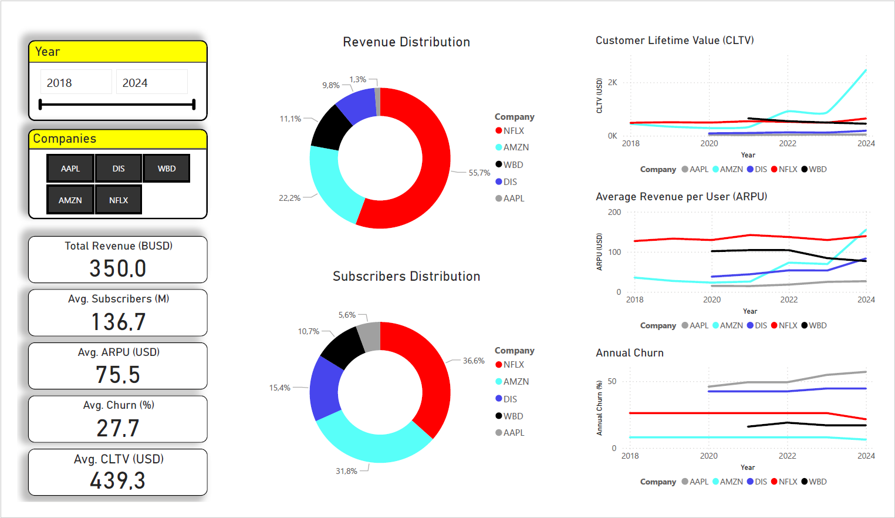
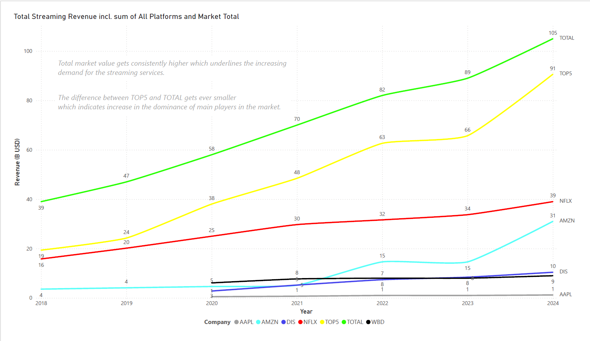
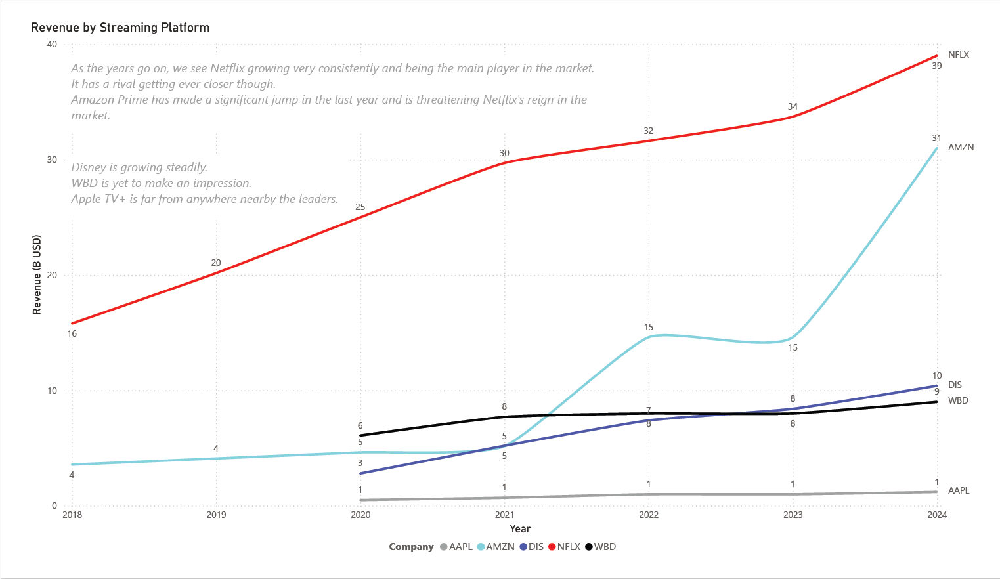
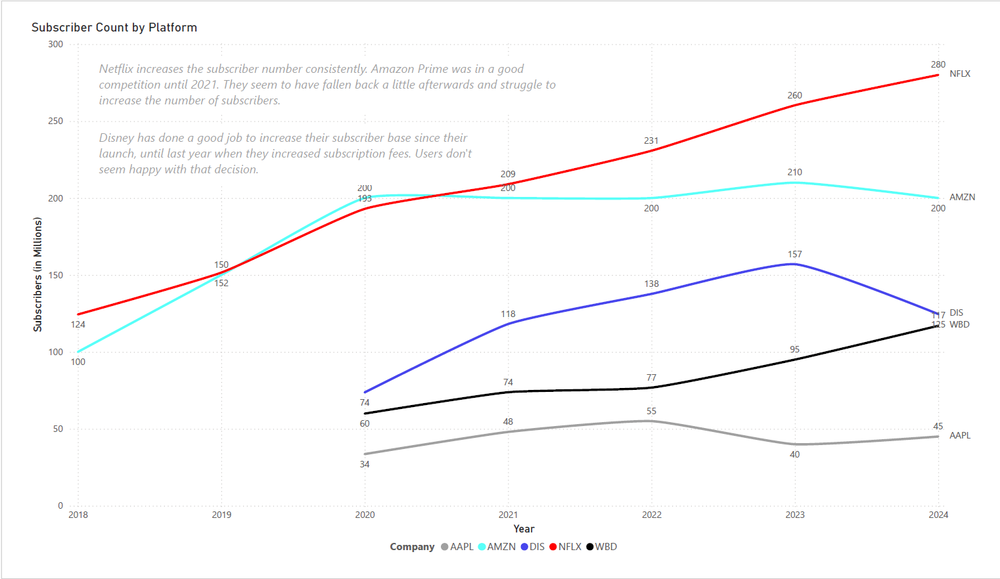
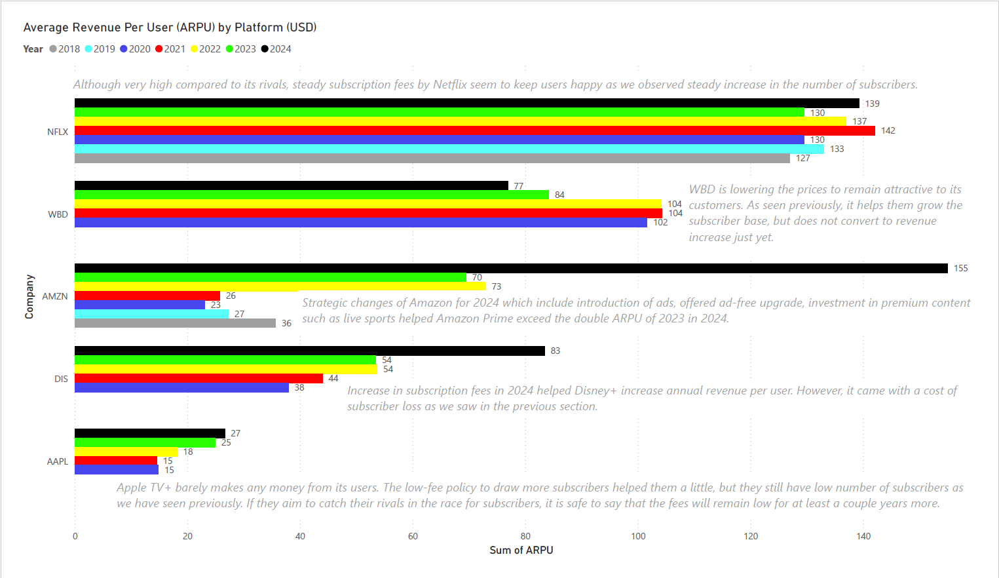
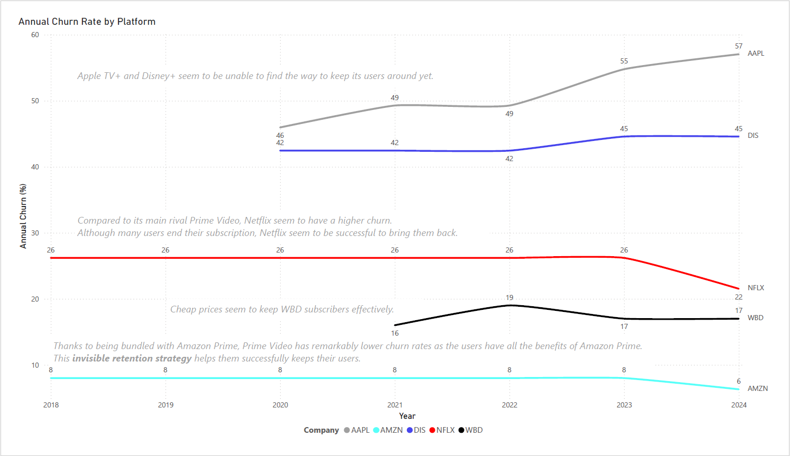
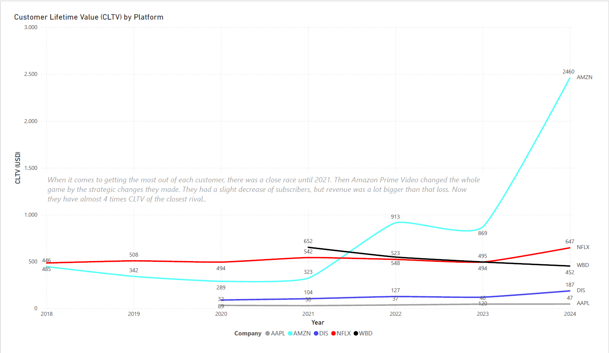

# 🎥 Streaming Industry KPI Dashboard (2018–2024)

A Power BI dashboard project analyzing the performance of five major streaming platforms using real-world data.

---

## 📌 Project Objective

This project benchmarks the business performance of **Netflix, Disney+, Amazon Prime Video, WBD (HBO Max), and Apple TV+** from 2018 to 2024 using 5 key metrics:
- Total Revenue
- Subscriber Count
- ARPU (Average Revenue per User)
- Churn Rate
- Customer Lifetime Value (CLTV)

The goal is to uncover competitive trends and strategic performance differences across the evolving streaming landscape.

---

## 🛠️ Tools Used

- **Power BI**: Visualization & dashboarding
- **Python (pandas, matplotlib)**: Data wrangling, enrichment, and KPI calculation
- **Excel**: Manual data sourcing & formatting
- **SQL (planned)**: For relational modeling if scaled

---
## 📊 Key Insights

- 📈 **Netflix** consistently leads the market ever since the first appearance of the streaming business.
- 📉 **Amazon Prime** is catching the leader at a fast pace thanks to its alternative business model.
- 📉 **Disney+** saw a decline in subscribers after 2023, yet maintained strong ARPU due to pricing models.
- ⚖️ **WBD** holds a stable position, but lacks momentum in both subscriber growth and value creation.
- 📊 **Apple TV+** shows steady ARPU growth, but still lags behind in scale and long-term user retention.

---

## 📷 Screenshots

| Visual | Description |
|--------|-------------|
|  | Dashboard |
|  | Revenue by company with TOP5 and TOTAL |
|  | Revenue by company  |
|  | Subscriber growth trend per platform |
|  | Average Revenue Per User over time |
|  | Annual churn rates based on external benchmarks |
|  | Customer Lifetime Value comparison by year |

> _(Screenshots folder should be added to your repo alongside this README)_

---

## 🧭 How to Use

1. Download the `.pbix` file:
